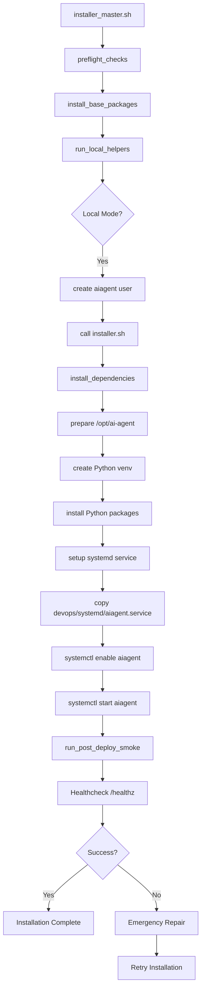
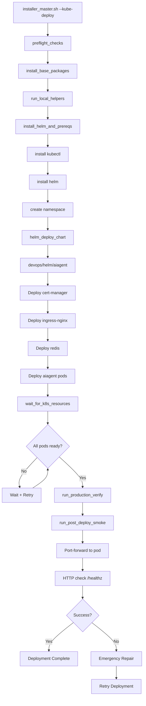
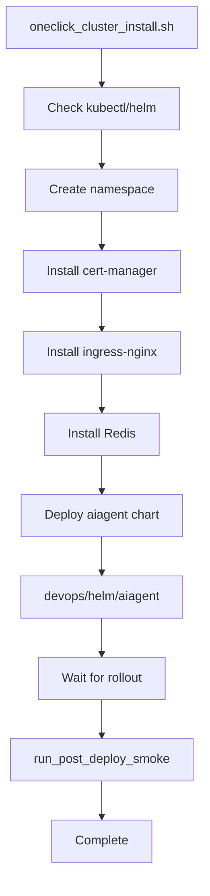
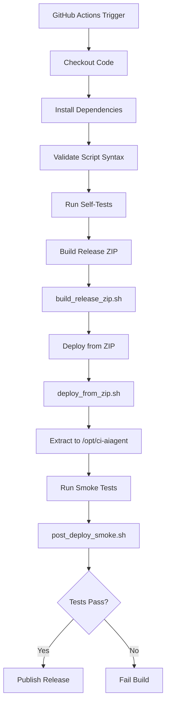
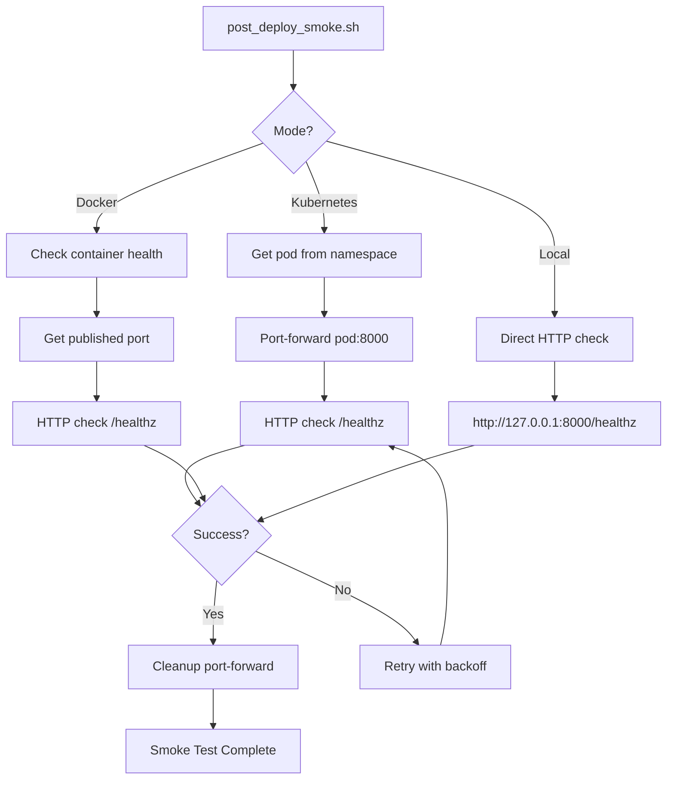
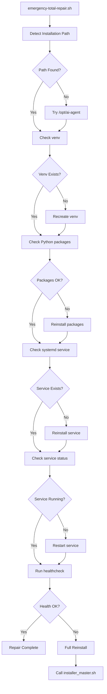
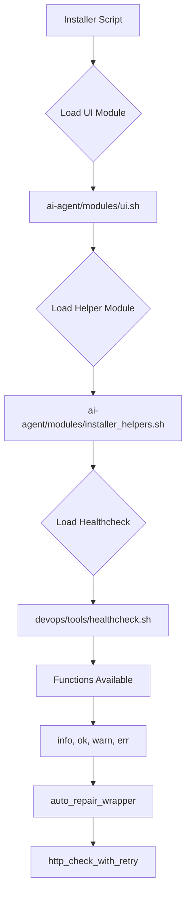
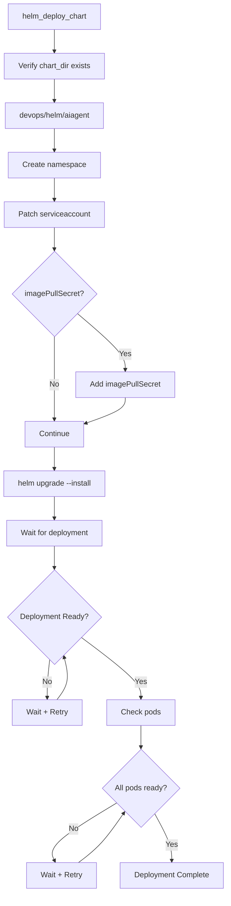

# Execution Flows Documentation

## AI-Cloudx Agent Repository

**Generated:** 2025-01-27  
**Analysis Method:** Max-Logic (Parse → Cross-reference → Infer → Validate)

---

## Overview

This document maps all execution flows in the AI-Cloudx Agent repository, showing how different components interact during installation, deployment, and operation.

---

## Flow 1: Local Installation (Systemd Mode)

### Entry Point
`installer_master.sh` (without `--kube-deploy` flag)

### Execution Sequence



### Key Components

- **Installer:** `installer_master.sh` → `installer.sh`
- **Target Path:** `/opt/ai-agent` (after standardization)
- **Service:** `devops/systemd/aiagent.service`
- **Verification:** `devops/tools/post_deploy_smoke.sh`

### Dependencies

- `ai-agent/modules/ui.sh` - UI functions
- `ai-agent/modules/installer_helpers.sh` - Helper functions
- `devops/tools/healthcheck.sh` - Health checks
- `devops/systemd/aiagent.service` - Systemd service

---

## Flow 2: Kubernetes Installation (Helm Mode)

### Entry Point
`installer_master.sh --kube-deploy` or `oneclick_cluster_install.sh`

### Execution Sequence



### Key Components

- **Installer:** `installer_master.sh` (kube mode) or `oneclick_cluster_install.sh`
- **Chart:** `devops/helm/aiagent/` (canonical)
- **Namespace:** `aiagent` (default)
- **Verification:** `devops/tools/post_deploy_smoke.sh` (k8s mode)

### Dependencies

- Helm 3.x
- kubectl
- Kubernetes cluster access
- cert-manager (for TLS)
- ingress-nginx (for ingress)
- Redis (for queue)

---

## Flow 3: One-Click Cluster Installation

### Entry Point
`oneclick_cluster_install.sh`

### Execution Sequence



### Key Components

- **Installer:** `oneclick_cluster_install.sh`
- **Chart:** `devops/helm/aiagent/`
- **Dependencies:** cert-manager, ingress-nginx, redis

---

## Flow 4: CI/CD Pipeline

### Entry Point
`.github/workflows/ci.yml` or `github_actions/workflows/ci.yml`

### Execution Sequence



### Key Components

- **Workflow:** `.github/workflows/ci.yml`
- **Build:** `build_release_zip.sh`
- **Deploy:** `devops/tools/deploy_from_zip.sh`
- **Test:** `devops/tools/post_deploy_smoke.sh`

---

## Flow 5: Health Check & Smoke Testing

### Entry Point
`devops/tools/post_deploy_smoke.sh`

### Execution Sequence



### Key Components

- **Script:** `devops/tools/post_deploy_smoke.sh`
- **Module:** `devops/tools/healthcheck.sh`
- **Function:** `http_check_with_retry()`

---

## Flow 6: Emergency Repair

### Entry Point
`tools/emergency-total-repair.sh`

### Execution Sequence



### Key Components

- **Script:** `tools/emergency-total-repair.sh`
- **Target:** `/opt/ai-agent` (after standardization)
- **Actions:** Repair venv, packages, systemd, restart services

---

## Flow 7: Module Loading

### Execution Sequence



### Module Dependencies

- **UI Module:** `ai-agent/modules/ui.sh`
  - Functions: `info()`, `ok()`, `warn()`, `err()`, `title()`
  
- **Helper Module:** `ai-agent/modules/installer_helpers.sh`
  - Functions: `auto_repair_wrapper()`, `retry_limited()`, `safe_backup()`
  
- **Healthcheck Module:** `devops/tools/healthcheck.sh` (canonical)
  - Functions: `http_check_with_retry()`, `tcp_check()`, `post_deploy_smoke()`

---

## Flow 8: Chart Deployment (Helm)

### Execution Sequence



### Key Components

- **Chart:** `devops/helm/aiagent/`
- **Release:** `aiagent`
- **Namespace:** `aiagent` (default)
- **Timeout:** 10 minutes

---

## Cross-Flow Dependencies

### Installer → Module → Service → Chart

```
installer_master.sh
  ├── sources: ai-agent/modules/ui.sh
  ├── sources: ai-agent/modules/healthcheck.sh (conflict: should use devops/tools/healthcheck.sh)
  ├── calls: installer.sh (local mode)
  ├── uses: devops/helm/aiagent (kube mode)
  ├── uses: devops/systemd/aiagent.service (local mode)
  └── calls: devops/tools/post_deploy_smoke.sh (verification)
```

### Healthcheck → Smoke Tests → Verification

```
devops/tools/post_deploy_smoke.sh
  ├── sources: devops/tools/healthcheck.sh
  ├── calls: http_check_with_retry()
  └── supports: local, docker, kubernetes modes
```

---

## Failure Modes & Recovery

### Failure Mode 1: Path Mismatch

**Symptom:** Service fails to start, files not found

**Recovery:**
1. Detect path conflict (`/opt/aiagent` vs `/opt/ai-agent`)
2. Run migration script
3. Update systemd service
4. Restart service

### Failure Mode 2: Chart Not Found

**Symptom:** Helm deployment fails, chart directory missing

**Recovery:**
1. Verify chart location (`devops/helm/aiagent`)
2. Update installer references
3. Retry deployment

### Failure Mode 3: Healthcheck Fails

**Symptom:** Smoke tests fail, service not responding

**Recovery:**
1. Check service status
2. Check logs
3. Run emergency repair
4. Retry healthcheck

---

## Max-Logic Validation

### Parse ✅
- All execution flows mapped
- Entry points identified
- Dependencies documented

### Cross-reference ✅
- Flow interactions verified
- Component relationships confirmed
- Failure modes analyzed

### Infer ✅
- Canonical paths determined
- Best practices identified
- Recovery procedures defined

### Test (Planned)
- Each flow will be tested independently
- Integration tests created
- Failure scenarios validated

### Reconstruct (Planned)
- Unified flows designed
- Conflicts resolved
- Dependencies normalized

### Validate (Planned)
- All flows validated against:
  - Existing deployments
  - CI/CD pipelines
  - Production environments

---

## Next Steps

1. Implement path standardization (affects all flows)
2. Consolidate charts (affects kube flows)
3. Unify healthcheck (affects verification flows)
4. Consolidate installers (affects installation flows)
5. Test each flow independently
6. Document rollback procedures

